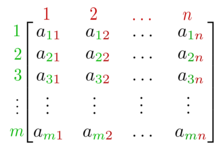

<div align="center">
    
    <br/>
    <b>Matrix computations, using C++.</b>
    <br/>
    <br/>
</div>

# Matrices

You can store matrices in the memory, and then make calculations on them. When you input a matrix using the `input` command, it will be appended to the list of matrices. Then to do calculations, you'll have to pass the index of the matrices you want to deal with. To make sure it's the right index, you can use the command `show` and then pass the index, to verify the values.

More infos in [Usage](https://github.com/fkS124/matrices#usage) or doing the command `help`.

# Compilation

To compile the code using `g++` run :
```shell
g++ main.cpp -o out src/*.cpp
```

And then run :
```shell
# on windows
./out.exe
# on linux
./out.out
```

# Usage

Function | Description
:-------:| -----------
`input`  | Allows you to input a matrix of your choice. (First the dimension, then the values)
`show`   | Shows the matrice of your choice (by giving its index).
`sum`    | Prints the sum of two matrices.
`sub`    | Prints the substraction of two matrices.
`multk`  | Prints the multiplication of a matrix by a real number.
`product`| Prints the product of two matrices (if they're compatible).
`exit`   | Exits the program
