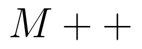

<div align="center">
    
    <br/>
    <b>Matrix computations, using C++.</b>
    <br/>
    <br/>
    
    
    
    
    
    <br/>
</div>

# Matrices

You can store matrices in the memory, and then make calculations on them. When you input a matrix using the `input` command, it will be appended to the list of matrices. Then to do calculations, you'll have to pass the index of the matrices you want to deal with. To make sure it's the right index, you can use the command `show` and then pass the index, to verify the values.

More infos in [Usage](https://github.com/fkS124/matrices#usage) or doing the command `help`.

# Compilation

To compile the code using `g++` run :
```shell
g++ main.cpp -o ./bin/out src/*.cpp
```
or if `make` is installed on your computer (you still need g++) :
```
make
```

And then run :
```shell
# on windows
./bin/out.exe
# on linux
./bin/out.out
```

# Usage

You have to run functions inside the mini-shell like following :

```
>>> func_name arg1 arg2(optional)
```

Function | Arguments | Description
:-------:| --------- | ----------- 
`input`  | ``2 args`` The dimension of your matrix (first the number of rows and then the number of columns.| Allows you to input a matrix of your choice. (First the dimension, then the values)
`show`   | ``1 arg`` The index of the matrix you want to show. | Shows the matrice of your choice (by giving its index).
`sum`    | ``2 args`` The indexes of the two matrices. | Prints the sum of two matrices.
`sub`    | ``2 args`` The indexes of the two matrices| Prints the substraction of two matrices.
`multk`  | ``2 args`` First the matrix, then the real number. | Prints the multiplication of a matrix by a real number.
`product`| ``2 args`` The indexes of the two matrices. | Prints the product of two matrices (if they're compatible).
`det`    | ``1 arg`` The index of the matrix. | Prints the determinant of the given matrix (if it's a square matrix).
`inv` | `1 arg` The index of the matrix. | Prints the inverse of the given matrix (if possible).
`pow` | `2 args` The index of the matrix and the power you want to calculate. | Prints the given matrix put to a given power.
`exit`   | `0 arg` | Exits the program
